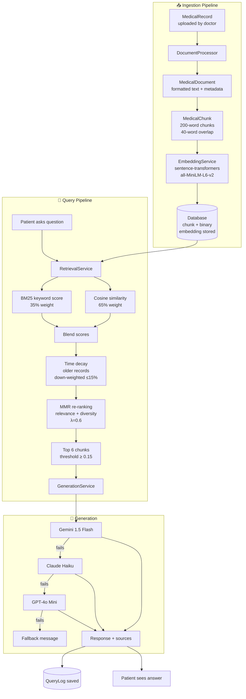
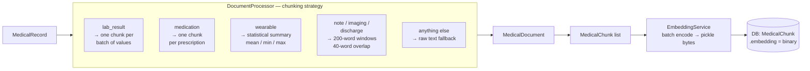
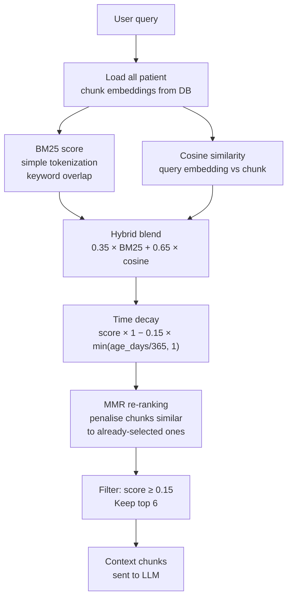
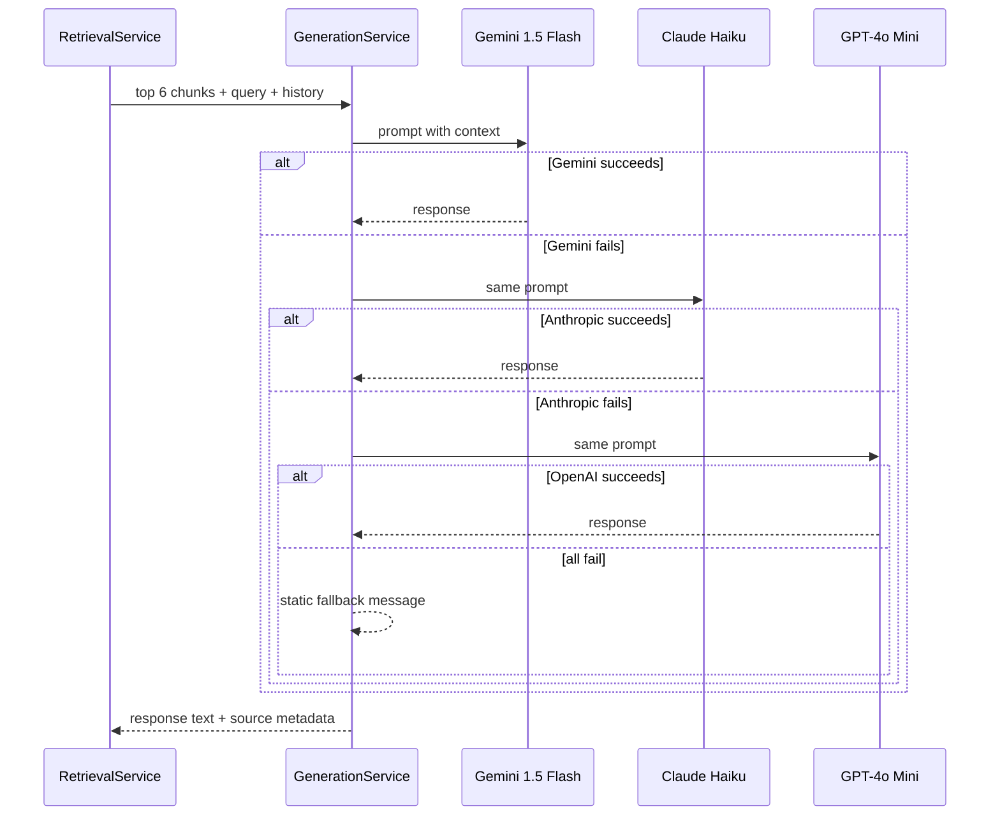
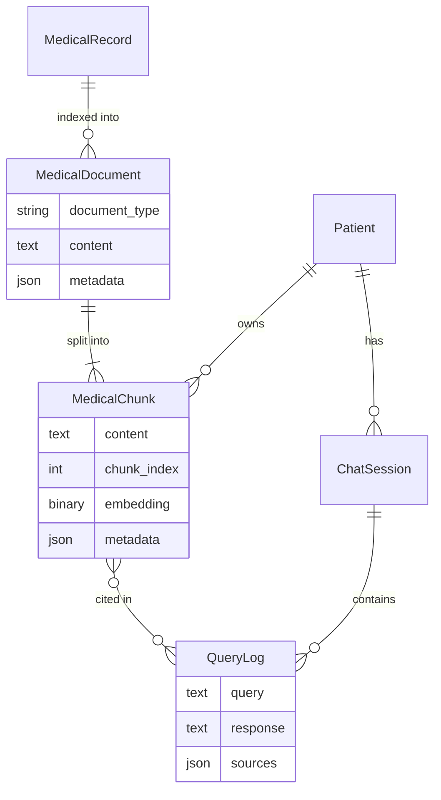

# RAG System Architecture — HealthCompass

## Overview

HealthCompass uses a **Hybrid Retrieval-Augmented Generation (RAG)** pipeline to answer patient health questions using their own medical records. It combines semantic (embedding) search with keyword (BM25) search, then feeds the best-matching context to an LLM.

---

## System Components



---

## Ingestion: How Records Become Searchable



---

## Retrieval: 6-Stage Scoring Pipeline



---

## Generation: Provider Chain



---

## Database Models



---

## Key Configuration

| Parameter | Value | Purpose |
|-----------|-------|---------|
| Embedding model | `all-MiniLM-L6-v2` | 384-dim sentence vectors |
| Chunk size | 200 words | Balance between context and precision |
| Chunk overlap | 40 words | Avoid cutting mid-sentence |
| BM25 weight | 35% | Keyword relevance |
| Semantic weight | 65% | Meaning-level relevance |
| Time decay | 15% max over 1 year | Prefer recent records |
| MMR lambda | 0.6 | 60% relevance, 40% diversity |
| Similarity threshold | 0.15 | Filter irrelevant chunks |
| Top-K | 6 chunks | Sent to LLM as context |
| Max tokens | 800 | LLM response length cap |

---

## File Map

```
rag_assistant/
├── models.py                  — MedicalDocument, MedicalChunk, ChatSession, QueryLog
├── rag_engine.py              — backward-compatible shim → delegates to services/
├── views.py                   — chat UI, API endpoints
└── services/
    ├── embedding_service.py   — encode text → binary vectors, bulk DB update
    ├── document_processor.py  — MedicalRecord → MedicalDocument → MedicalChunk
    ├── retrieval_service.py   — BM25 + cosine + decay + MMR → top-6 chunks
    ├── generation_service.py  — Gemini → Anthropic → OpenAI provider chain
    └── rag_service.py         — orchestrator: ask() and index_record() public API
```
